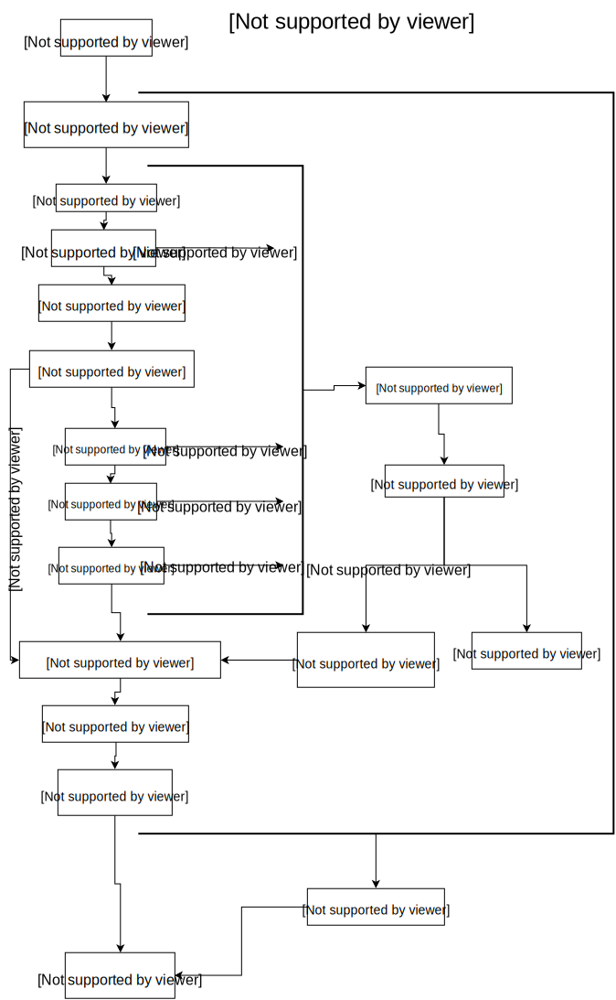

.. _quickstart:

快速上手
========

一个最小的应用
-------------------

A minimal Flask-Restaction API:

.. code-block :: python

    from flask import Flask
    from flask_restaction import Resource, Api

    app = Flask(__name__)
    api = Api(app)

    class Hello(Resource):
        schema_inputs = {
            "get": {
                "name": {
                    "desc": "you name",
                    "required": True,
                    "validate": "safestr",
                    "default": "world"
                }
            }
        }

        def get(self, name):
            return {"hello": name}

    api.add_resource(Hello)
    api.gen_resjs()
    api.gen_resdocs()
    
    if __name__ == '__main__':
        app.run(debug=True)

Save this as ``hello.py``, then run it: 

保存为 ``hello.py``, 然后运行：

.. code ::

    $ python hello.py
     * Running on http://127.0.0.1:5000/
     * Restarting with reloader

Then open browser, visit ``http://127.0.0.1:5000/hello``

打开浏览器，访问 ``http://127.0.0.1:5000/hello``

You will see: 

.. code ::

    {
      "hello": "world"
    }

Visit ``http://127.0.0.1:5000/hello?name=kk``

再访问 ``http://127.0.0.1:5000/hello?name=kk``

You will see: 

.. code ::

    {
      "hello": "kk"
    }

那么，这些代码是什么意思呢？

1. 首先导入了 :class:`~flask_restaction.Resource` 和 :class:`~flask_restaction.Api` 类
2. 创建了一个 ``Api`` 类的实例，把 ``Flask`` 类的一个实例作为参数
3. 创建了一个 ``Hello`` 类，继承自 ``Resource`` 类
4. 定义 schema_inputs，它指定了输入参数及格式
5. 调用 api.add_resource(Hello) ，把 Hello 添加到 api 资源中
6. 生成 res.js 和 resdocs.html 文件

URL 构建 Use url_for 
--------------------

可以使用 flask 中的 url_for() 函数构建指定 action 的 URL，
endpoint 名称是 ``resource@action_lastpart`` 。

The endpoint is ``resource@action_lastpart``::
    
    resource -> resource class name, lowcase
    action   -> action's last part name, lowcase

格式 format::

    Resource.action_lastpart -> url_for("resource@lastpart") -> /resource/lastpart

For example::
    
    Hello.get -> url_for("hello") -> /hello
    # suppose Hello.get_list exists
    Hello.get_list -> url_for("hello@list") -> /hello/list
    Hello.post_login -> url_for("hello@login") -> /hello/login
    
Use res.js
-----------

Use res.js to access api is very simple, and you can also use jquery or other libs.

使用 res.js 可以方便的调用 api ，当然了，使用 jquery 或者其他一些库也是完全可以的。

Let's write test.html and save it in static folder

现在来写一个 test.html 并保存到 static 目录

.. code-block :: html

    <!DOCTYPE html>
    <html>
    <head>
        <meta charset="utf-8">
        <title>test res.js</title>
        
        
    </head>
    <body>
        <input id="name" type="text" placeholder="you name">
        

        <button onclick="send()">GetHello</button>
    </body>
    </html>

Then open browser, visit ``http://127.0.0.1:5000/static/test.html``

Have a try, and notice schema_inputs's ``"validate": "safestr"``

打开浏览器，访问 ``http://127.0.0.1:5000/static/test.html``

尝试一下，注意 ``schema_inputs`` 中的 ``"validate": "safestr"``

If you input some unsafe strings (hacker attack), such as: 

你如果输入一些不安全的字符（黑客攻击），例如：

````

Then you inputs will be escape to avoid attack:

你输入的字符串会被转义成如下内容：

``{"hello":"&lt;script type=&#34;text/javascript&#34;&gt;alert(&#34;haha&#34;)&lt;/script&gt;"}``

**注意 look at this:**

.. code-block :: javascript
    
    #引用 res.js 文件
    

    #调用 api
    res.hello.get(data, function(err, value) {
        msg = JSON.stringify(err || value)
        document.getElementById("message").innerText = msg;
    });

You can use ``res.resource.action(data, function(err, value))`` to access resources provided by rest api.

你可以用 ``res.resource.action(data, function(err, value))`` 调用 api.

- ``resource`` is resource's name, such as ``hello``, is not always resource's classname, 
  depends on :meth:`flask_restaction.Api.add_resource` 

- ``action`` is ... such as ``get`` , ``post`` ... 
  not only http method, ``get_list`` , ``post_upload`` is ok, 
  just make sure start with http method and ``_`` .

- ``function(err, value)`` is callback function

- If you use blueprint, then You should use 
  ``res.blueprint.resource.action(data, function(err, value))`` to access resources.

- ``resource`` 是 resource 的名称，例如 ``hello``，不一定是 resource 的 classname ，
  取决于 :meth:`flask_restaction.Api.add_resource` 。

- ``action`` 是 ... 例如 ``get`` , ``post`` ... 不仅仅是 http method, 
  ``get_list`` , ``post_upload`` 也可以，只要是以 http method 加 下划线 ``_`` 开头就行。

- ``function(err, value)`` 是回调函数

- 如果用的是蓝图（``blueprint``），就要用 
  ``res.blueprint.resource.action(data, function(err, value))`` 调用 api 。

Py2&py3
---------

Flask-restaction support py3 since v0.17.0, tested on py27 and py34.
and more tests is required to make it more stable.

Also, you should use the latest version of flask.

You'd better put statements below to the head of all modules if you use py2. 
It will reduce you work of transfer to py3.

Flask-restaction 从 v0.17.0 开始支持 py3，在 py27 和 py34 上测试通过。
但是还需要更多测试来使它更稳定。

同时，你要使用最新版的 flask 。

如果你使用 py2 ，最好将下面几句加到每个模块的开头。这样在你以后迁移到 py3 的时候会容易的多。

.. code-block:: python

    # coding:utf-8

    from __future__ import unicode_literals
    from __future__ import absolute_import

Validater 验证输入输出
------------------------

Resource class use ``schema_inputs``, ``schema_outputs``, ``output_types`` 
to validate inputs and outputs.

The ``output_types`` is a list of class that you want to return, 
then the return value will be proxy as a dict.

You can split schema dict into some tuples and combine them into 
``schema_inputs`` and ``schema_outputs``.

Resource 类使用 ``schema_inputs``, ``schema_outputs``, ``output_types`` 来指定如何验证输入输出。

``output_types`` 是一个 list ，列表中的元素是你返回的自定义类型对象的类型，
这样返回的对象会被包装成一个 dict 。

你可以把 schema 分成几个 tuple ，然后在 ``schema_inputs`` and ``schema_outputs`` 中合并。

For example:

.. code-block:: python

    class Hello(Resource):

        schema_name = ("name", {
            "desc": "name",
            "required": True,
            "validate": "name",
            "default": "world"
        })
        schema_date = ("date", {
            "desc": "date",
            "required": True,
            "validate": "datetime",
        })
        schema_hello = ("hello", {
            "desc": "hello",
            "required": True,
            "validate": "str",
        })
        schema_inputs = {
            "get": dict([schema_name]),
            "post_login": dict([schema_name, schema_date]),
        }
        schema_outputs = {
            "get": dict([schema_hello]),
            "post_login": dict([schema_hello, schema_date])
        }

        # if you return a custom type object
        # output_types = [custom_type]

        def get(self, name):
            return {"hello": name}

        def post_login(self, name, date):
            return {
                "hello": name,
                "date":date,
            }

For more information, see `validater <https://github.com/guyskk/validater>`_

I suggest you have a look at 
`built-in validater <https://github.com/guyskk/validater#schema-format>`_

想要了解更多，请移步 `validater <https://github.com/guyskk/validater>`_

建议你看一下内置的 validater 
`built-in validater <https://github.com/guyskk/validater#schema-format>`_

Authorize 身份验证
-------------------

flask_restaction use ``json web token`` for authorize.

flask_restaction 使用 ``json web token`` 作为身份验证工具。

see `https://github.com/jpadilla/pyjwt <https://github.com/jpadilla/pyjwt>`_

**You should add you own auth_secret to api**, default auth_secret is ``"SECRET"``, see :class:`~flask_restaction.Api` for detail

**你需要把自己的 auth_secret 添加到 api 中**，默认值是 ``"SECRET"``, see :class:`~flask_restaction.Api` for detail。

You can access auth info by ``request.me``, it's struct is:

你可以通过 ``request.me`` 获取用户的身份信息，它的结构如下:
.. code ::

    {
        "id":user_id, 
        "role":user_role
    }

And you should add auth header(default ``Authorization``) to response after user login, it's value can be generate
by ``api.gen_token(me)`` or ``api.gen_auth_token(me)``.

此外，你需要在用户登录成功后添加 auth 响应头(default ``Authorization``) 到响应中，它的值可以通过 ``api.gen_token(me)`` or ``api.gen_auth_token(me)`` 生成。

**user_role function of Resource (user_role 函数)**

.. code-block:: python

    class User(Resource):

        @staticmethod
        def user_role(user_id):
            return "role of user" or "*" if user not exists

This function must be decorated by ``@staticmethod``, it will be called before request and it's return value will be
in ``request.me["role"]``, then permission system will use it.

这个函数必须用 ``@staticmethod`` 装饰，它会在请求处理之前调用，它的返回值会在 ``request.me["role"]`` 中，权限系统需要使用它。

The Usage of user_role（user_role 函数的用处）

A application(website) will be divide into some fields (modules). A user can be different role in different field, and only one role in one field. A field consist of some Resources or only one Resource, so this can avoid the effect of user/permission system when add new Resource or new field to you application.

一个应用（网站）通常会划分成几个领域（模块）。一个用户在不同的领域会担任不同的角色，但是在一个领域只应当承担一个角色。一个领域由一些 Resource 组成，这样划分可以可以避免在添加新领域，新功能的时候影响原有的用户和权限系统。

**注意 Note:**

res.js will auto add auth header(default ``Authorization``) to request if needed, and will auto save auth token to localstroge when recive auth header

在访问需要权限的资源时，res.js 会自动添加 auth 请求头 (default ``Authorization``) 到请求中。
并且当收到 auth 响应头时，会自动将 auth token 保存到浏览器 localstroge 中。

Permission control 权限控制
------------------------------

``permission.json`` permission table

By default, ``permission.json`` should be saved in root path of you flask application, you can change to other path, see :ref:`api` .

permission subdivide by role->resource->action

默认情况下，``permission.json`` 应当文件放在应用的根目录下，你也可以改成放到其他位置， see :ref:`api` 。

权限按 角色 -> 资源 -> 操作 划分

JSON struct

.. code ::

    {
        "role/*": {
            "*/resource*": ["get", "post"],
            "resource": ["action", ...]
        },
        ...
    }

- When role is ``*``, represent anonymous user.

- When resource is ``*``, represent the role can access all resources all actions, 
  actions must be ``[]`` and can't has other resource.

- When resource is ``resource*``, represent the role can access this resource's all action, 
  actions must be ``[]``.

- role and resource must be combine of a-z_0-9 and start with a-z.

- 当 role 为 ``*`` 时，表示匿名用户的权限。

- 当 resource 为 ``*`` 时，表示该角色可以操作所有 resource 的所有 action ，
  此时 actions 必须是 ``[]`` 并且不能有其他 resource。

- 当 resource 为 ``resource*`` 时，表示该角色可以操作该 resource 的所有 action ，
  此时 actions 必须是 ``[]``。

- role 和 resource 只能由小写字母和下划线组成，并且以小写字母开头。

Work with Blueprint 使用蓝图
-----------------------------

.. code-block :: python

    from flask import Flask, Blueprint
    from flask_restaction import Api
    from .article import Article

    app = Flask(__name__)

    #1
    bp_api = Blueprint('api', __name__, static_folder='static')
    api = Api(bp_api)

    #2
    api.add_resource(Article)

    #3
    app.register_blueprint(bp_api, url_prefix='/api')

    #4
    api.gen_resjs()
    api.gen_resdocs()

- You should add ``static_folder='something'`` to Blueprint if you need gen_resjs or gen_resdocs, because res.js and resdocs.html is save in Blueprint's static_folder.

- You should do #1, #2, #3, #4 orderly, otherwise will cause error, because Resource urls was registered when register_blueprint and permission was inited after register_blueprint.

- 如果你需要 gen_resjs 或 gen_resdocs ，你应当添加 ``static_folder='something'`` 到 Blueprint 中，因为生成的 res.js 和 resdocs.html 都要保存到 Blueprint 的 static 目录中。

- 你必须按 #1, #2, #3, #4 的顺序组织代码，否则会造成错误。因为 Resource urls 在 register_blueprint 时绑定，permission 在 register_blueprint 之后初始化。

Process Flow 请求处理流程
-----------------------------

kkblog 介绍
-----------------------------

KkBloG 是一套基于 Python 的多人博客系统，你可以用 markdown 格式写文章，保存到 github ，然后就可以在上面展示自己的博客，别人还可以评论你的文章。

这个项目是对flask-restaction框架的一次尝试。

see `https://github.com/guyskk/kkblog <https://github.com/guyskk/kkblog>`_
