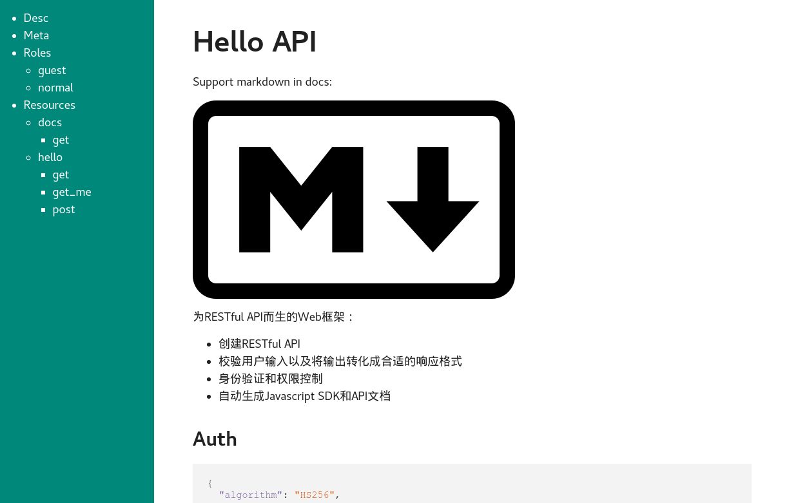

.. _quickstart:

快速上手
========

Welcome
-------------------

.. code-block:: python

    from flask import Flask
    from flask_restaction import Api

    app = Flask(__name__)
    # 创建一个 Api 对象，把 app 作为参数
    api = Api(app)

    # 创建 Welcome 类，描述欢迎信息(框架可以序列化任意类型的对象)
    class Welcome:

        def __init__(self, name):
            self.name = name
            self.message = "Hello %s, Welcome to flask-restaction!" % name

    # 创建一个 Hello 类，定义 get 方法
    class Hello:
        """Hello world"""

        # 在 get 方法文档字符串中描述输入参数和输出的格式
        def get(self, name):
            """
            Get welcome message

            $input:
                name?str&default="world": Your name
            $output:
                message?str: Welcome message
            """
            return Welcome(name)

    # 添加资源
    api.add_resource(Hello)
    # 配置API文档的访问路径
    app.route('/')(api.meta_view)

    if __name__ == '__main__':
        app.run(debug=True)

保存为 ``hello.py``, 然后运行：

.. code::

    $ python hello.py
     * Running on http://127.0.0.1:5000/
     * Restarting with reloader

打开浏览器，访问 http://127.0.0.1:5000/hello

.. code::

    {
      "message": "Hello world, Welcome to flask-restaction!"
    }

再访问 http://127.0.0.1:5000/hello?name=kk

你将会看到

.. code::

    {
      "message": "Hello kk, Welcome to flask-restaction!"
    }

访问 http://127.0.0.1:5000 可以查看自动生成的文档。

.. glossary:: 两个概念
    *resource*
        资源，比如这里的 Hello 类

    *action*
        操作，例如 get, post, delete, get_list, post_login。
        只要是 HTTP 方法或 HTTP 方法加下划线 _ 开头就行

校验输入输出
-------------------

在Api的参数 ``Api(docs=__doc__)`` 中用 *$shared* 描述全局共享的Schema。

在Resource的文档字符串中用 *$shared* 描述Resource内共享的Schema。

在Action的文档字符串中用 *$input*, *$output* 描述输入输出Schema, 用 *$error* 描述可能返回的错误。

*$input*
    输入格式，如果没有$input，则不校验输入，以无参数的形式调用Action。
    实际数据来源取决于HTTP方法，GET和DELETE请求，取自url参数，
    POST,PUT和PATCH请求，取自请求体，Content-Type为 ``application/json``。

*$output*
    输出格式，如果没有$output，则不校验输出。

*$error*
    描述可能返回的错误，仅作为API文档，例如::

        $error:
            400.InvalidData: 输入参数错误
            403.PermissionDeny: 权限不足

    格式为: ``status.ErrorSymbol: message``。

请求参数校验失败会返回::

    {
        "status": 400,
        "error": "InvalidData",
        "message": "xxx xxxx"
    }

响应内容校验失败会返回::

    {
        "status": 500,
        "error": "ServerError",
        "message": "xxx xxxx"
    }

Schema为 `YAML <https://zh.wikipedia.org/wiki/YAML>`_ 格式的字符串, Schema语法见 :ref:`schema`

**自定义 Validater**

在 Validater 的文档中讲述了自定义 Validater 的用法。所有自定义的 validater 通过
Api(validaters=validaters) 进行注册。

关于 Validater, 请移步 `Validater <https://github.com/guyskk/validater>`_

构建 URL
---------------------------

可以使用 flask 中的 url_for() 函数构建指定 action 的 URL。

endpoint (url_for 的参数) 是 ``resource@action_name``

*resource*
    Resource类名称的小写

*action_name*
    Action的后半部分(下划线分隔)

格式::

    url_for("resource@action_name") -> /resource/action_name

示例::

    url_for("hello") -> /hello
    url_for("hello@login") -> /hello/login

返回错误信息
----------------------------

.. code-block:: python

    from flask_restaction import abort

    # 函数原型
    abort(code, error=None, message=None)

如果没有error参数，效果和 ``flask.abort(code)`` 一样。
如果有error是 ``flask.Response`` 类型，效果和 ``flask.abort(code, error)`` 一样。
其他情况返回内容为::

    {
        "status": code,
        "error": error,
        "message": message
    }

返回内容会序列化为适当的格式。

权限管理
-------------------

**举个栗子**:

meta.json 设定角色和权限

.. code-block:: json

    {
        "$roles": {
            "admin": {
                "hello": ["get", "post"],
                "user": ["post"]
            },
            "guest": {
                "user": ["post"]
            }
        }
    }

__init__.py 根据token确定角色

.. code-block:: python

    from flask_restaction import Api, TokenAuth

    api = Api(metafile='meta.json')
    auth = TokenAuth(api)

    @auth.get_role
    def get_role(token):
        if token:
            return token["role"]
        else:
            return "guest"

hello.py 业务代码

.. code-block:: python

    class Hello:

        def get(self):
            pass

        def post(self):
            pass

user.py 登录接口

.. code-block:: python

    from flask import g

    class User:

        def __init__(self, api):
            self.api = api

        def post(self, username, password):
            # query user from database
            g.token = {"id": user.id, "role": user.role}
            return user

**使用情景**

用户A直接调用 ``hello.get`` 接口，框架收到请求后，从请求头的 ``Authorization`` 中取出 ``token`` ，
此时 ``token`` 为 ``None``，然后框架调用 ``get_role(None)`` ，得到角色 ``guest`` ，再判断
``meta["$roles"]["guest"]["hello"]`` 中有没有 ``get``，发现没有，框架直接拒绝此次请求。

用户A调用 ``user.post`` 接口，框架的处理流程同上，因为 ``meta["$roles"]["guest"]["user"]`` 中有 post，
框架允许此次请求，请求到达 ``user.post`` 方法，验证用户名和密码，如果验证成功，就设置
``g.token``，``token`` 里面保存了用户ID，角色和过期时间。TokenAuth会将 ``g.token`` 用JWT进行签名，
然后通过响应头的 ``Authorization`` 返回给用户。

用户A再次调用 ``hello.get`` 接口，在请求头的 ``Authorization`` 中带上了刚才得到的 ``token`` ，
框架先用JWT验证 ``token`` 的完整性和过期时间，如果没问题，再调用 ``get_role(token)``，得到用户角色。
假设得到的角色是 ``admin``，因为 ``meta["$roles"]["admin"]["user"]`` 中有 ``post``，框架允许此次请求，
请求到达 ``hello.get`` 方法。

**在 metafile 中设定角色和权限**

metafile是一个描述API信息的文件，通常放在应用的根目录下，文件名 meta.json。
在Api初始化的时候通过 ``Api(metafile="meta.json")`` 加载。

.. code::

    {
        "$roles": {
            "Role": {
                "Resource": ["Action", ...]
            }
        }
    }

请求到来时，根据 Role, Resource, Action 可以快速确定是否许可此次请求。

提示：flask 的 `Development Server <http://flask.pocoo.org/docs/0.11/server/>`_
不能检测到 python 代码文件之外变动，所以修改 metafile 的内容之后需要手动重启才能生效。

**注册 get_role 函数**

框架通过URL能解析出Resource, Action，但是无法知道用户是什么角色, 所以需要你提供一个能返回用户角色的函数。

**生成 token**

为了能够确认用户的身份，需要在用户登录成功后生成一个 token，将 token 通过响应头(``Authorization``)返回给用户。
token 一般会储存用户ID和过期时间，用户在发送请求时需要将 token 通过请求头发送给服务器。

TokenAuth使用 *json web token* 作为身份验证工具，见 `pyjwt <https://github.com/jpadilla/pyjwt>`_ 。

.. Note::

     token 会用密钥(app.secret_key)对 token 进行签名，无法篡改，生成 token 前需要先设置 app.secret_key，或通过 flask 配置。
     token 是未加密的，不要把敏感信息保存在里面。

身份/权限验证失败会返回::

    {
        "status": 403,
        "error": "PermissionDeny",
        "message": "xxx can't access xxxx"
    }

**安全性和设置**

对安全性要求不同，权限管理的实现也会不同，TokenAuth的实现适用于对安全性要求不高的应用。

当收到请求时，检测到token即将过期，会主动颁发一个新的token给客户端，这样能避免token过期
导致中断用户正常使用的问题。但这样也导致token能够被无限被刷新，有一定的安全隐患。

以下是默认设置::

    {
        "$auth": {
              "algorithm": "HS256",     # token签名算法
              "expiration": 3600,       # token存活时间，单位为秒
              "header": "Authorization" # 用于传递token的请求/响应头
              "cookie": null            # 用于传递token的cookie名称, 默认不用cookie
              "refresh": true           # 是否主动延长token过期时间
        }
    }

**自定义权限管理**

``Api.authorize(role)`` 方法能根据 ``$roles`` 和请求URL判断该角色是否有权限调用API，
利用它可以简化自定义权限管理实现。

以下是基本结构，具体实现可以参考 ``flask_restaction/auth.py``。

.. code-block:: python

    class MyAuth:

        def __init__(self, api):
            self.api = api
            self.config = api.meta["$auth"]
            api.before_request(self.before_request)
            api.after_request(self.after_request)

        def before_request(self):
            """Parse request, check permission"""
            # parse role from request
            self.api.authorize(role)

        def after_request(self, rv, status, headers):
            """Modify response"""
            return rv, status, headers

添加资源
-----------------------------

使用 ``Api.add_resource`` 方法添加资源，传给 ``add_resource`` 的参数都会原封不动的传给Resource的 ``__init__`` 方法。

路由路径是和Resource名称相同的，如果需要指定不同的路径，可以通过创建一个新Resource实现:

.. code-block:: python

    api.add_resource(type('NewName', (MyResource,), {}))

一个Resource可能要依赖其他对象，或者是依赖于网络上的另一个API。
使用依赖注入的方式为Resource提供依赖，而不是使用全局变量。

例如，User依赖于其他对象::

    class User:

        def __init__(self, dependecy):
            self.dependecy = dependecy

    dependecy = Xxx()
    api.add_resource(User, dependecy=dependecy)

API文档
-------------------

有两种方式配置API文档的访问路径。

**Flask.route**

.. code-block:: python

    app.route('/')(api.meta_view)

**Api.add_resource**

这种方式把文档作为一种资源添加到API中，可以方便的控制文档的访问权限。

.. code-block:: python

    api.add_resource(type('Docs', (), {'get': api.meta_view}))

Api.meta_view也能返回JSON格式的API元数据，只需要设置请求头 ``Accept`` 为 ``application/json`` 即可。

在 metafile 里面配置 $resjs 为生成的 res.js 文件的 URL，则可以在文档页面通过浏览器控制台使用 res.js。

使用蓝图
-----------------------------

Api可以放在蓝图中，这样所有的 Resource 都会路由到蓝图中。

.. code-block:: python

    from flask import Flask, Blueprint
    from flask_restaction import Api

    app = Flask(__name__)
    bp = Blueprint('api', __name__)
    api = Api(bp)
    api.add_resource(XXX)
    app.register_blueprint(bp)

注意：add_resource 需要在 register_blueprint 之前执行，否则 add_resource 无效。

事件处理
--------------------------

Api提供before_request, after_request, error_handler这3个装饰器用来注册事件处理函数。

.. code-block:: python

    @api.before_request
    def before_request():
        # 此函数会在在请求到来的第一时间执行
        # 若response不为None，则不再继续处理请求
        return response

    @api.after_request
    def after_request(rv, status, headers):
        # 此处可以对Action中的返回值进行处理
        return rv, status, headers

    @api.error_handler
    def error_handler(ex):
        # 处理从before_request到Action过程中抛出的异常
        # 若response不为None，则返回此response给客户端
        return response

自定义响应格式
---------------------

默认响应格式为JSON，你也可以很方便的添加自定义的响应格式。

.. code-block:: python

    from flask import make_response
    from flask_restaction import exporter

    @exporter('text/html')
    def export_text(data, status, headers):
        return make_response(str(data), status, headers)

框架会根据请求头中Accept的值选择合适的响应格式。

使用 res.js
---------------------------

详细用法见 :ref:`resjs`

使用 res.py
---------------------------

res.py 的用法类似于 res.js，网络请求用的是requests库。

.. code-block:: python

    >>> from flask_restaction import Res
    >>> help(Res)

Examples
--------------------

`项目主页 <https://github.com/guyskk/flask-restaction>`_ 的 examples 目录。

对比其它框架
--------------------

**flask-restful**
~~~~~~~~~~~~~~~~~~~~

flask-restaction 相对于 flask-restful 有什么优势，或是什么特性?

- 输入输出校验

    restaction 是声明式的，简单明确::

        class Hello:

            def get(self, name):
                """
                Get welcome message

                $input:
                    name?str&escape&default="world": Your name
                $output:
                    message?str: Welcome message
                """

    restaction 的输出校验和输入校验一样简单，而且可以序列化任意类型的对象。

    restful 中叫做 Request Parsing::

        from flask_restful import reqparse

        parser = reqparse.RequestParser()
        parser.add_argument('name', type=str, help='Your name')
        args = parser.parse_args()

    Request Parsing 很繁琐，不能很好的重用代码。

- 清晰的URL规则

    restaction 的 URL 规则清晰，并始终保持一致，减少了编码和阅读API文档的负担。

- 身份验证及权限控制

    restaction 提供一个灵活的权限系统，身份验证基于 jwt(json web token)，
    权限验证是通过json配置文件，而不是散布在代码中的装饰器(decorator)。

- 自动生成文档和res.js

    restaction 可以自动生成文档和 res.js，用 res.js 可以方便的调用 api。

历程
-----------------------------

**2015年9月4日 - 2015年12月**

项目开始

将validater作为一个独立项目

自动生成文档和res.js

添加身份验证和权限控制

重写身份验证和权限控制，之前的用起来太繁琐

**2016年1月20日 - 2月24日**

重写 validater，增强灵活性，去除一些混乱的语法

重构 Api
    - 将权限从 Api 里面分离
    - 将自动生成工具从 Api 里面分离，优化 res.js
    - 去除测试工具，因为 flask 1.0 内置测试工具可以取代这个
    - 将 testing.py 改造成 res.py，用于调用 API，功能类似于 res.js

**2016年3月 - 5月**

内部项目使用 flask-restaction 框架，项目已内测。
期间修复一些bug，做了小的改进和优化，Api基本未变。

**2016年5月 - 5月12日**

完善 res.js，对代码进行了重构和测试，支持模块化和标准 Promise。

**2016年7月 - 8月**

重写 validater，形成完善的Schema语法。
重构 flask-restaction，使用YAML格式定义输入输出Schema。

**2016年9月 - 9月12日**

用NodeJS重写res.js，支持用NodeJS和Python两种方式生成res.js。
支持生成HTML格式的API文档。
